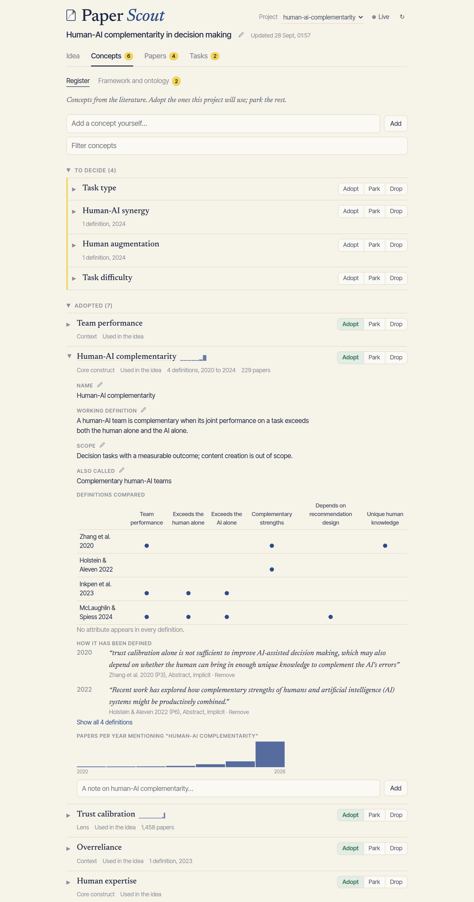

<p align="center">
  
</p>

<p align="center">
  <b>Search, read and think with the literature from inside Claude, without spending a fortune in tokens.</b><br>
  Your Zotero library, Semantic Scholar, OpenAlex and arXiv in one place, plus a notebook that remembers<br>
  your concepts, your argument and how it changed.
</p>

---

## What is this? 🧭

Paper Scout started as an itch: I liked doing research with the [Feynman](https://github.com/companion-inc/feynman) agent harness for my PhD work, but not in a terminal. So I brought it into the Claude desktop app and kept adding the things I missed while on my research process.

The repository has two parts that work together:

| Part | What it does |
| --- | --- |
| **Paper Scout** (`extension/`) | A desktop extension for Claude. It searches and reads papers with as few tokens as possible, keeps a ledger of everything you screened, and stores a **research map** (concepts, framework, the versioned idea, tasks) as plain files in your project folder. It also serves the **Research Desk**, a local page where you make the decisions. |
| **Feynman for Cowork** (`feynman/`) | A plugin with Feynman's research workflows (literature review, deep research, peer review, drafting and more) adapted to Claude's Cowork mode, with explicit start and end commands so it only runs when you want it. |

The rule behind everything: **Claude proposes, you decide.** Claude brainstorms, suggests concepts, links evidence and drafts. Adopting a concept, accepting a relationship or rewriting your idea always waits for you. True human-in-the-wheel.

## A quick tour

### The idea 💡

Every project starts from an idea, and ideas change. The Idea page opens on the current statement. Framing, methodology and literature stay folded until you need them. Below sits the history: what changed, when, and what prompted it (a paper, a supervision meeting, your own thinking), with the wording differences marked.

<p align="center"></p>

A notes box sits right under the idea. Jot a thought or a supervisor's comment and Claude folds it into the next proposal.

### Concepts 📚

Terms that keep coming up in the literature land here as candidates. Adopt, park or drop them. Each concept keeps its definitions verbatim with their source and year, a table comparing what each definition includes, how often the term appears per year, and your own working definition.

<p align="center"></p>

### Framework and ontology 🗺️

Draw the conceptual framework of your project by dragging concepts around and connecting them. Every arrow can point to the claim that justifies it, and its style tells you how solid it is: solid when supported, dashed when there is no evidence yet, red when contested. Claude's suggestions arrive as dotted arrows for you to accept or reject. Save versions as you go, and export a clean black-and-white figure for your paper.

<p align="center"></p>

Underneath, a working ontology places each concept as a kind of, or a part of, another.

<p align="center"></p>

### Tasks ✅

A calm board for what to read, answer, write or check. Reading suggestions from Feynman, long comments from your supervisor and questions you put to the literature all end up here. Questions carry their verdict and the positions found.

<p align="center"></p>

### Papers

Screen papers into keep, maybe or drop, open their summaries and evidence cards, and export BibTeX with your own Better BibTeX keys. Preprints are matched to their published version automatically, and the ones that were never published are labelled as such.

<p align="center"></p>

### One page for supervision

A plain, printable summary of the current idea, its framing, the argument with its sources, key concepts, recent changes and open points, with references in APA.

<p align="center"></p>

### Night Mode 🌙

<p align="center">
  
</p>

The screenshots show a small example project built from real papers on human-AI complementarity. The idea itself is only there for illustration.

## How it saves tokens

Paper Scout gives every paper a short handle (`P12`) and shows it as a single line. Papers already seen collapse to a stub, repeated searches are answered from memory, summaries come before abstracts, and full texts are read section by section or by passage. Your Zotero library is read directly from disk (read only), so the papers you already have cost almost nothing to find.

## Installation

You need the [Claude desktop app](https://claude.ai/download) and Node.js 18 or newer.

**1. Build and install the extension**

```bash
cd extension
npm install
npm run pack
```

Open the resulting `paper-scout.mcpb` with the Claude desktop app. In its settings you can add:

| Setting | Why |
| --- | --- |
| Semantic Scholar API key | Faster, more reliable search ([request one here](https://www.semanticscholar.org/product/api)) |
| OpenAlex API key or email | Polite access to OpenAlex |
| Zotero data folder | So Paper Scout can read your library |
| Library proxy | A link prefix for paywalled papers (it defaults to the University of Groningen; change it to your own) |

**2. Add the Feynman plugin**

```bash
cd feynman
zip -r ../feynman.plugin .
```

Open `feynman.plugin` with the Claude desktop app, then type `/feynman:start` in a Cowork task.

## Using it

| Command | What happens |
| --- | --- |
| `/feynman:start` | Turns on research mode for the task, connects your project and gives you the Research Desk link |
| `/feynman:ask <question>` | A quick answer from the literature: verdict, positions, debate and a reading list |
| `/feynman:lit <topic>` | A full literature review with citations and provenance |
| `/feynman:deepresearch <question>` | A thorough, cited research brief |
| `/feynman:review <paper or draft>` | A tough peer review |
| `/feynman:draft <topic>` | A paper-style draft built on your research map |
| `/feynman:end` | Leaves research mode |

The full list appears when you run `/feynman:start`. Outside those commands you can simply talk to Claude: "add this as a concept", "record this as the new version of the idea", "what supports claim K2?".

## Where your data lives

Everything about a project lives in its own folder, readable without the tool:

- `research-map.json`, the map itself
- `research-map.md`, a readable copy regenerated on every change
- `research-summary.html` and `research-framework.svg` when you export them

Paper metadata and full texts are cached on your computer. Nothing is sent anywhere except the lookups to the public scholarly APIs.

## Credits 🙏

- **[Feynman](https://github.com/companion-inc/feynman)** by Companion, Inc. is the foundation of this project. Its research workflows, subagents and working rules were adapted here for Claude's Cowork mode. Feynman is released under the MIT licence; see [`feynman/NOTICE`](feynman/NOTICE).
- **[Claude](https://claude.ai)** by Anthropic is the environment all of this runs in. Paper Scout is a desktop extension (MCP server) and Feynman for Cowork is a plugin of skills and subagents on top of the Claude desktop app.
- Paper data comes from [Semantic Scholar](https://www.semanticscholar.org), [OpenAlex](https://openalex.org), [arXiv](https://arxiv.org), [Unpaywall](https://unpaywall.org) and your own [Zotero](https://www.zotero.org) library.
- The research map borrows from discourse graphs (Chan et al., 2024), concept definition methods (Podsakoff, MacKenzie and Podsakoff, 2016; Suddaby, 2010) and W3C SKOS.
- Typefaces: [Newsreader](https://fonts.google.com/specimen/Newsreader) and [Inter Tight](https://fonts.google.com/specimen/Inter+Tight).

## Licence

MIT, see [LICENSE](LICENSE). Made by [Guillermo Gil de Avalle](https://github.com/guille-gil).
